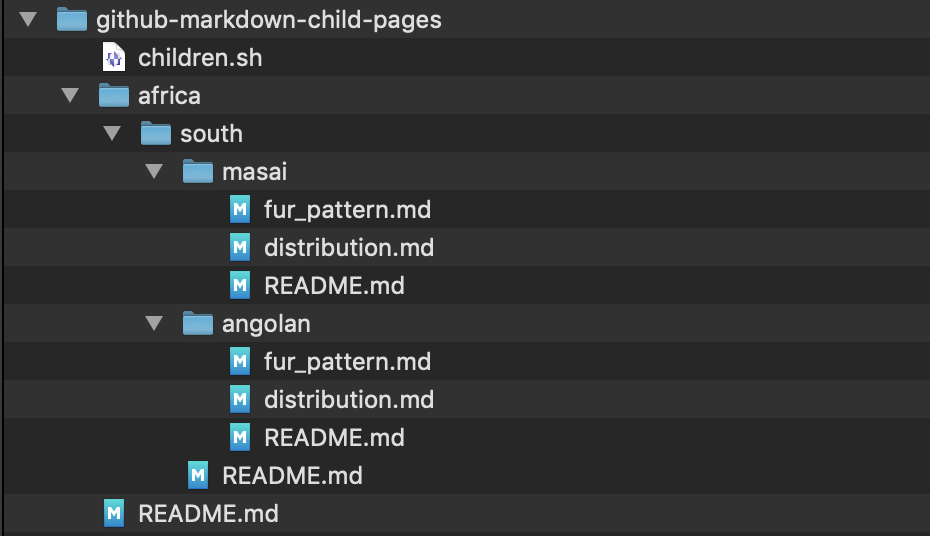

# github-markdown-child-pages

## Problem

Markdown doesn't provide for any sort of child-pages capability to generate any sort of navigatable hierarchy, forcing one to manually create (and, ugh, update) said links over time. (This is really a step down from other page-management systems.)

From a file system that looks like this:



I want to show readers something like:

<!-- github-markdown-child-pages-start -->
&#9122; [github-markdown-child-pages](./README.md)<br>
&#9123; africa<br>
&nbsp;&nbsp;&nbsp;&nbsp;&#9123; south<br>
&nbsp;&nbsp;&nbsp;&nbsp;&nbsp;&nbsp;&nbsp;&nbsp;&#9122; [South African Giraffes](./africa/south/README.md)<br>
&nbsp;&nbsp;&nbsp;&nbsp;&nbsp;&nbsp;&nbsp;&nbsp;&#9122; angolan<br>
&nbsp;&nbsp;&nbsp;&nbsp;&nbsp;&nbsp;&nbsp;&nbsp;&#9122;&nbsp;&nbsp;&nbsp;&#9122; [Angolan Giraffe](./africa/south/angolan/README.md)<br>
&nbsp;&nbsp;&nbsp;&nbsp;&nbsp;&nbsp;&nbsp;&nbsp;&#9122;&nbsp;&nbsp;&nbsp;&#9122; [distribution range & map](./africa/south/angolan/distribution.md)<br>
&nbsp;&nbsp;&nbsp;&nbsp;&nbsp;&nbsp;&nbsp;&nbsp;&#9122;&nbsp;&nbsp;&nbsp;&#9123; [fur pattern](./africa/south/angolan/fur_pattern.md)<br>
&nbsp;&nbsp;&nbsp;&nbsp;&nbsp;&nbsp;&nbsp;&nbsp;&#9123; masai<br>
&nbsp;&nbsp;&nbsp;&nbsp;&nbsp;&nbsp;&nbsp;&nbsp;&nbsp;&nbsp;&nbsp;&nbsp;&#9122; [Masai Giraffe](./africa/south/masai/README.md)<br>
&nbsp;&nbsp;&nbsp;&nbsp;&nbsp;&nbsp;&nbsp;&nbsp;&nbsp;&nbsp;&nbsp;&nbsp;&#9122; [distribution range & map](./africa/south/masai/distribution.md)<br>
&nbsp;&nbsp;&nbsp;&nbsp;&nbsp;&nbsp;&nbsp;&nbsp;&nbsp;&nbsp;&nbsp;&nbsp;&#9123; [fur pattern](./africa/south/masai/fur_pattern.md)<br>
<small><small><i>Generated by <a href="https://github.com/mickeys/github-markdown-child-pages">github-markdown-child-pages</a></i>.</small></small>
<!-- github-markdown-child-pages-end -->

## Solution
A bare-bones bash script, [children.sh](./children.sh), that generates a graphical representation of nested folders and providing hyperlinks to Markdown documents with the document title as the link text.

## Overview

Rather than re-enginering I provide a wrapper around the UNIX `tree` command to output Markdown. In this repo I created nesting folders with Markdown files to demonstrate; the resulting output looks like:

## Usage

This is a work in progress; _currently_ I change directory - `cd` - to each repository and run

```
children.sh .
```

where the `.` refers to the current location, from which the generated relative links refer. 

## Future usage & directions

The output is wrapped by markers:

```
<!-- github-markdown-child-pages-start -->
<!-- github-markdown-child-pages-end -->
```

and it's my hope that once you've added the above in all the Markdown files to which you want child
listings I'll be able to recursively traverse a nested folders of git repositories, cleaning out the existing content between the markers and replace with a current version. For the moment I'm content with being able to generate a child-page listing for my existing repos, some of which are filled with a variety of related items.

**TO-DO:** add a command-line switch to include the first paragraph of a child Markdown file into the listing as a teaser.

**TO-DO:** consider making hyperlinks to non-Markdown files optional via command-line switch.